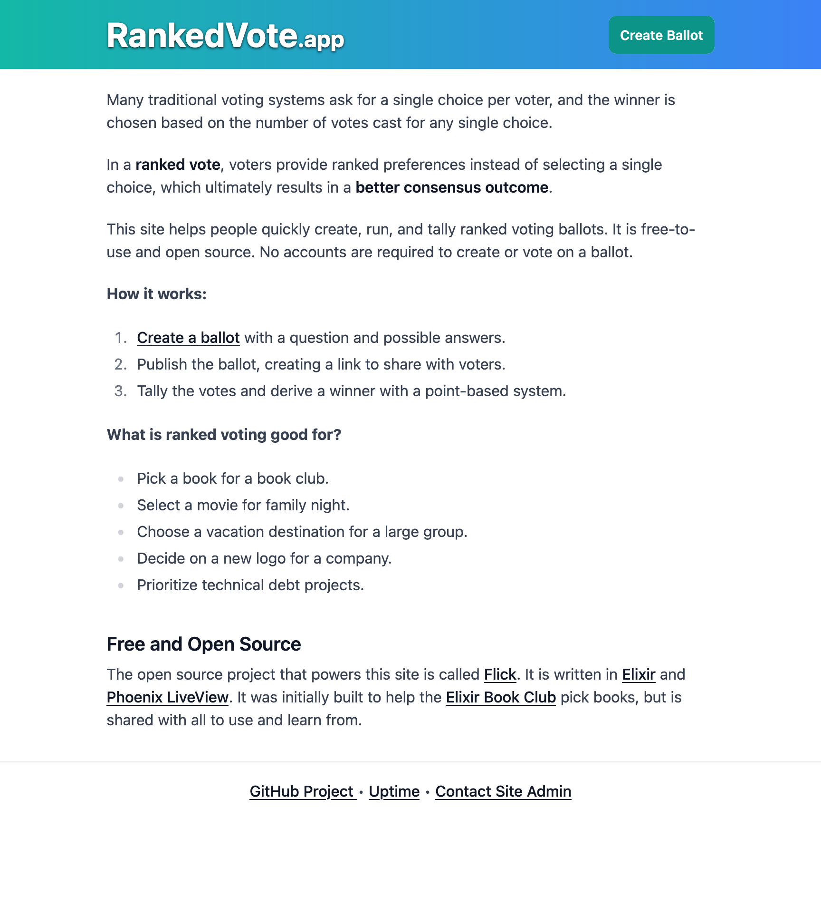
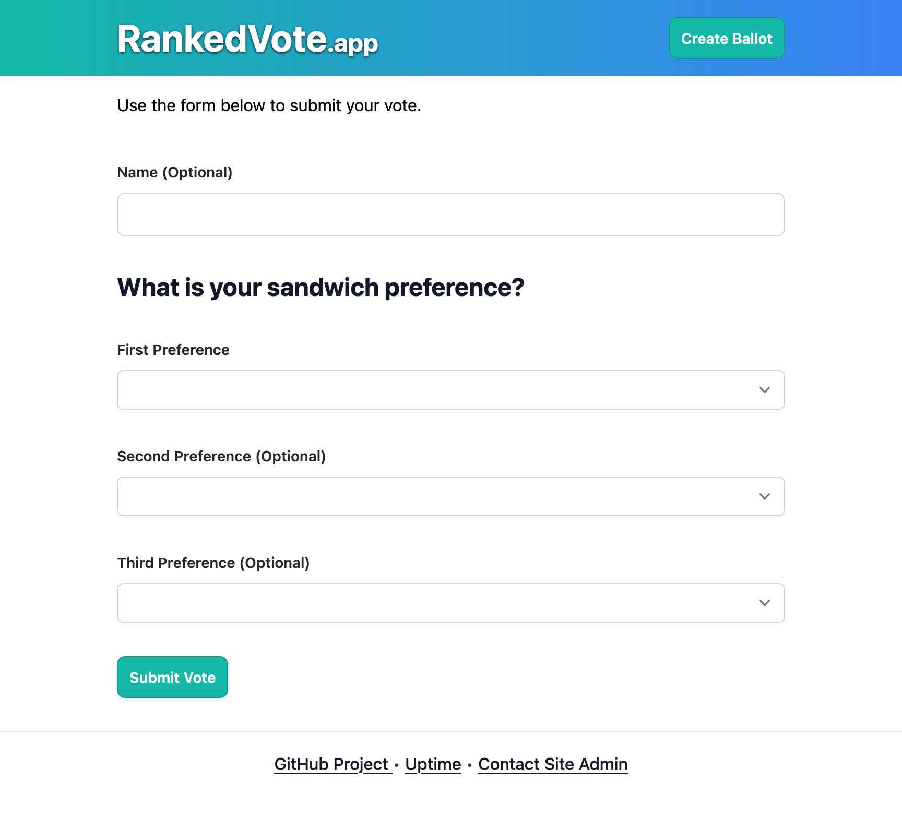

# Flick

Flick is a simple Elixir / Phoenix LiveView app that helps capture ranked votes. You can see this project in action at <https://rankedvote.app/>.

This project was built to help the [Elixir Book Club](https://elixirbookclub.github.io/website/) pick books, but it is open to all.

## Highlights

- No accounts are needed to create ballots or cast votes.
- Votes are ranked votes that help find a better overall consensus.
- Individual voters can be weighted.
- A ballot can be closed, stopping future votes from being cast.

## Notable Future Enhancements

- The project is very trusting and has no aggressive security against people voting more than once. Flick is intended for honest polling.
- The ballot creation form asks users to enter comma-delimited options, and I'd like to revert this to dynamic inputs to allow more user-friendly entry of long option names.
- See [Issues](https://github.com/zorn/flick/issues) for more.

## Project Demo

YouTube: <https://www.youtube.com/watch?v=pxE6AbaQuUM>

## Screenshots

## Standard Phoenix Readme

To start your Phoenix server:

  * Run `mix setup` to install and setup dependencies
  * Start Phoenix endpoint with `mix phx.server` or inside IEx with `iex -S mix phx.server`

Now you can visit [`localhost:4000`](http://localhost:4000) from your browser.

Ready to run in production? Please [check our deployment guides](https://hexdocs.pm/phoenix/deployment.html).

## Learn more

  * Official website: https://www.phoenixframework.org/
  * Guides: https://hexdocs.pm/phoenix/overview.html
  * Docs: https://hexdocs.pm/phoenix
  * Forum: https://elixirforum.com/c/phoenix-forum
  * Source: https://github.com/phoenixframework/phoenix
