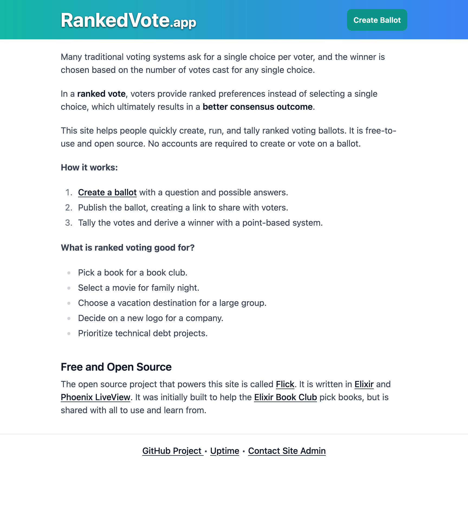
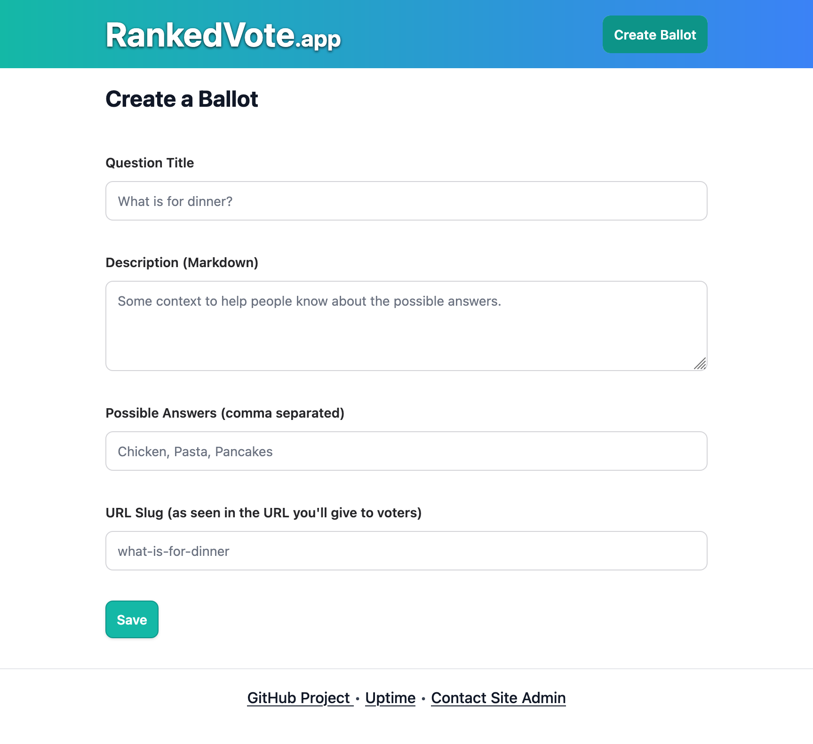
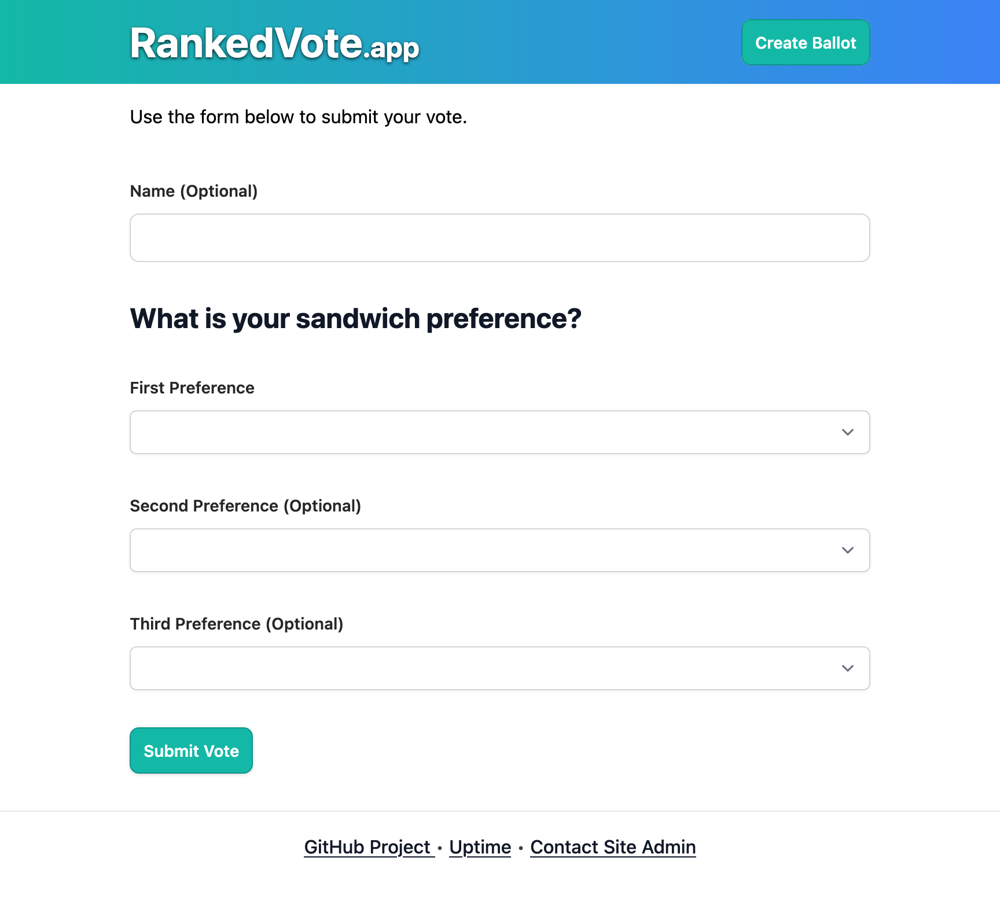

# Flick


Flick is a simple Elixir / Phoenix LiveView app that helps capture ranked votes. You can see this project in action at <https://rankedvote.app/>.

This project was built to help the [Elixir Book Club](https://elixirbookclub.github.io/website/) pick books, but it is open to all.

## Highlights

- No accounts are needed to create ballots or cast votes.
- Votes are ranked votes that help find a better overall consensus.
- Individual voters can be weighted.
- A ballot can be closed, stopping future votes from being cast.

## Notable Future Enhancements

- The project is very trusting and has no aggressive security against people voting more than once. Flick is intended for honest polling.
- The ballot creation form asks users to enter comma-delimited options, and I'd like to revert this to dynamic inputs to allow more user-friendly entry of long option names.
- See [Issues](https://github.com/zorn/flick/issues) for more.

## Project Demo

YouTube: <https://www.youtube.com/watch?v=pxE6AbaQuUM>

## Screenshots








## Running in Local Development

### Install Elixir via `asdf`

This project is built using Elixir and Erlang, and as such we define specific version targets using `.tool-versions` a file format of the [asdf project](https://asdf-vm.com/). Please refer to it for [various installation options](https://asdf-vm.com/guide/getting-started.html). Once installed, run the following from the project root to make sure you have the required versions.

```bash
$ asdf install
```

### Start Postgres

This project requires a Postgres database for storage and a Docker Compose file to run a containerized version is provided via `compose.yml`. You are not required to run Postgres via a container, and a standard on metal installation should work fine too.

Before attempting to run the Phoenix app, be sure to start the Docker container with:

```bash
$ docker compose up -d
```

To shutdown you can run:

```bash
$ docker compose down -d
```

### Start Phoenix

To start your Phoenix server:

  * Run `mix setup` to install and setup dependencies
  * Start Phoenix endpoint with `mix phx.server` or inside IEx with `iex -S mix phx.server`

Now you can visit [`localhost:4000`](http://localhost:4000) from your browser.

Ready to run in production? Please [check our deployment guides](https://hexdocs.pm/phoenix/deployment.html).

### Parallel worktrees (optional)

Flick is set up for [worktrunk](https://worktrunk.dev) (`wt`), which creates git worktrees so that several copies of the app, or several coding agents, can run side by side. Nothing above depends on it. A normal checkout ignores these files and keeps port 4000 and the `flick_dev` database.

A worktree made with `wt` gets its own copy of `_build` and `deps`, its own port, and its own dev and test databases. The port and database names are in the worktree's `.env.worktree`, which `config/runtime.exs` reads.

Set up each machine once with [the runbook's setup steps](https://github.com/zorn/dotfiles/blob/main/worktrunk/README.md#set-up-each-machine-once). Flick's `.config/wt.toml` calls a hook script installed by those steps. Without it, `wt` reports an error and leaves the worktree without its databases, and `mix` in that worktree refuses to start rather than fall back to `flick_dev`.

Create and remove these worktrees only with `wt`, because its hooks create the databases and drop them again. A worktree removed any other way leaves its databases behind. [The worktree runbook](https://github.com/zorn/dotfiles/blob/main/worktrunk/README.md) in zorn/dotfiles covers the full flow: setup, creating and opening a worktree in Herdr, working in it, removing it, and what to do when removal stops.

## Learn more

  * Official website: https://www.phoenixframework.org/
  * Guides: https://hexdocs.pm/phoenix/overview.html
  * Docs: https://hexdocs.pm/phoenix
  * Forum: https://elixirforum.com/c/phoenix-forum
  * Source: https://github.com/phoenixframework/phoenix
